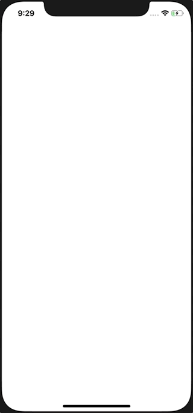

# Now Playing Movies

  

Sample application that fetches the now playing movies from [themoviedb.org API][1].

This app follows [Google's BLoC architectural][2] pattern and is covered with both widget and integration tests.

[0]: app-preview.gif
[1]: https://developers.themoviedb.org/3
[2]: https://medium.com/flutter-io/build-reactive-mobile-apps-in-flutter-companion-article-13950959e381
